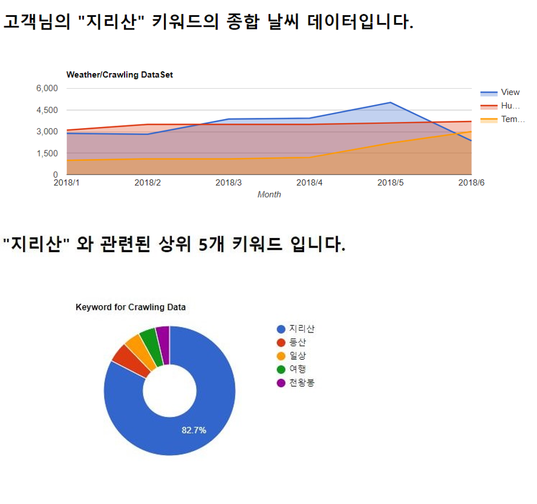

## SNS 데이터를 이용한 여행지 분석 프로젝트

1. 인스타그램의 해시태그 데이터를 크롤링(수집)한다.
2. 수집한 해시태그 데이터를 전처리한다.
3. 공공 데이터 포털에서 내려받은 전국 날짜별 날씨 데이터셋과 수집한 인스타그램 데이터를 비교한다.
4. 날씨별 방문 빈도(해시태그된 갯수), 같이 태그된 키워드의 순위 데이터를 분석한다.

## Python Package

* Flask (Flask/1.0.2) - API Server
* Flask-restful (Flask-RESTful/0.3.6) - API Server
* PyMySQL (PyMySQL/0.9.2)
* SQLAlchemy (SQLAlchemy/1.2.12) - ORM
* numpy (numpy/1.15.2) - Data Analysis
* pandas (pandas/0.23.4) - Data Analysis
* selenium (selenium/3.14.1) - Crawling
* BeautifulSoup (bs4/0.0.1, beautifulsoup4/4.6.3) - Crawling
* lxml (lxml/4.2.5)
* mysqlclient (mysqlclient/1.3.13, mysql 필요)
* request (request/1.0.2)
* xlrd (xlrd/1.1.0)

## Web(Java) Framework & Library

* Spring
* Google Chart
